# Tangent Forge Work-to-Execution Contract

Status: Implemented locally; live rollout requires separate deployment approval

Date: 2026-08-04

Scope: Company-wide intake, execution, evaluation, reconciliation, and truthful delivery reporting

## Executive decision

Linear is a portfolio and admission surface. Paperclip is the execution control plane. Git, artifact storage, deployed services, and live readback are delivery evidence. None of those systems may infer the truth owned by another system.

Backlog and Todo are not execution signals. Triage is the only Linear state that can request admission. Triage does not itself prove readiness: the item must also carry a valid `tf-work/v1` contract. Admitted work receives a stable work id, an accountable owner, a named execution queue, an evaluator, acceptance criteria, required receipts, stop conditions, and rollback instructions.

Assignment is not execution. A comment is not a deliverable. A local file is not a reviewable publication. A commit is not a deployment. A deployment is not proof that the live behavior works.

## What was broken

The previous flow collapsed several different meanings into tracker state:

1. Ideas in Backlog or Todo were treated as executable work.
2. Assignment to a person or agent was treated as a durable execution path.
3. “Done” described activity completion even when the promised result was only a recommendation, an untracked local artifact, or an unpushed commit.
4. Linear and Paperclip could disagree without a deterministic reconciliation rule.
5. Humans were used as memory, queue runners, and state reconciliers instead of approval authorities.

This made the company look busy while leaving the owner responsible for remembering which item to ask about next. It also created false confidence: the tracker could say done while no user-reviewable or live result existed.

## Global impact

- Strategy accumulates faster than execution.
- Every new project inherits ambiguous ownership and state semantics.
- Work stalls silently when an assignee does not initiate the next action.
- Agents can create more definitions and comments without advancing the outcome.
- Review, publication, deployment, and live verification are routinely conflated.
- Portfolio reporting cannot answer the basic question: “What exists now, what is actually running, and what happens next without me remembering it?”
- The owner becomes the scheduler and reconciler for the entire company.

## PAMCRAFT engineering frame

This design uses the following explicit review sequence:

- **Problem**: define the failed business behavior, not merely the broken integration.
- **Assumptions**: name source-of-truth and authority boundaries.
- **Model**: separate intake, admission, execution, evaluation, delivery, and reconciliation.
- **Contract**: encode the minimum machine-readable work agreement.
- **Risks**: fail closed on ambiguous scope, credentials, destructive actions, and delivery claims.
- **Acceptance**: specify independently observable criteria and receipts before execution.
- **Failure and rollback**: state stop conditions, escalation owner, and recovery path.
- **Tests**: run positive, negative, duplicate, drift, and misleading-state canaries.

The sequence is repeatable across sales, software, construction, healthcare discovery, operations, and internal research. Domain-specific fields can extend the contract, but they cannot remove its core controls.

## System model

```mermaid
flowchart LR
  A["Idea or request"] --> B["Linear Backlog or Todo: portfolio only"]
  B --> C["TF Chief of Staff prepares and reviews work contract"]
  C -->|"not ready"| B
  C -->|"explicit admission"| D["Linear Triage plus valid tf-work/v1 contract"]
  D --> E["Paperclip issue with stable work id and execution queue"]
  E --> F["Agent or governed automation executes"]
  F --> G["Evaluator checks acceptance and receipts"]
  G -->|"insufficient"| F
  G -->|"approval required"| H["Human decision gate"]
  G -->|"sufficient"| I["Truthful delivery state"]
  I --> J["Reconciler compares Linear, Paperclip, Git, artifact, deploy, and live evidence"]
  J -->|"conflict"| K["Correct state and route next action"]
  J -->|"consistent"| L["Close with preserved receipts"]
```



## Source-of-truth boundaries

| Concern | Authority |
|---|---|
| Portfolio, prioritization, and explicit admission request | Linear |
| Execution ownership, wakeups, runs, blockers, and next-action liveness | Paperclip |
| Source revision and reviewable commit identity | Git |
| Inspectable generated deliverables | Paperclip attachments or governed artifact storage |
| Published/deployed revision | Deployment provider and deployment receipt |
| Actual user-facing behavior | Live readback or bounded canary evidence |
| Strategy, rationale, and durable company knowledge | Canonical knowledge system after approval |

No authority is inferred across these boundaries. For example, a Linear assignee is not an active Paperclip run, and a Git commit is not a deployment.

## Admission contract

The Linear description contains one fenced JSON block:

````markdown
```tf-work-contract
{
  "version": "tf-work/v1",
  "workId": "linear:<linear-issue-id>",
  "outcome": "Observable result promised by this work",
  "classification": "standard",
  "roles": {
    "accountableOwner": "TF Chief of Staff",
    "executionQueue": "paperclip:<queue-or-agent>",
    "evaluator": "work-evaluator",
    "approvalOwner": "owner when a named boundary is reached"
  },
  "scope": {
    "included": ["explicitly authorized work"],
    "excluded": ["outreach", "deployment", "secret access unless separately approved"]
  },
  "executionEnvelope": {
    "allowedActions": ["read-only discovery", "isolated implementation", "targeted tests"],
    "prohibitedActions": ["destructive mutation", "external publication without approval"]
  },
  "requirements": ["preserve prior evidence"],
  "acceptance": {
    "criteria": ["observable criterion"],
    "requiredReceipts": ["test", "artifact"],
    "deliveryState": "published_reviewable"
  },
  "dependencies": [],
  "stopConditions": ["approval boundary reached", "source truth conflict"],
  "rollback": "Exact recovery procedure"
}
```
````

Admission rules:

1. The current Linear state must be exactly Triage.
2. The contract must parse and validate.
3. `workId` must equal `linear:<Linear issue id>`.
4. A named execution queue and evaluator must exist.
5. Scope, prohibited actions, acceptance receipts, stop conditions, and rollback must be explicit.
6. Backlog and Todo are rejected even if connector configuration drifts and lists them as candidate states.
7. Admission creates at most one Paperclip issue and one idempotent triage wakeup.

## Chief of Staff role

TF Chief of Staff is the triage agent, not the universal worker and not a human reminder proxy. Its job is to:

- inspect the intake item and the proposed outcome;
- validate or complete the work contract;
- identify missing authority or dependencies;
- route admitted work to the correct execution queue;
- preserve the stable work id and admission receipt;
- ensure every non-terminal item has an active, waiting, or recovery path;
- escalate only decisions that genuinely require human authority.

The Chief of Staff must not convert every idea into executable work, perform prohibited actions, or declare delivery based on tracker activity.

## Delivery states

The evaluator reports the strongest evidenced state, not the desired state:

1. `defined`
2. `assigned`
3. `executing`
4. `local_artifact_untracked`
5. `local_commit_reviewable`
6. `published_reviewable`
7. `deployed`
8. `live_verified`

The contract names the minimum required delivery state and receipt kinds. Completion is valid only when both the delivery rank and all required receipts are satisfied.

Examples:

- A recommendation comment is `defined`, not done.
- An untracked local file is `local_artifact_untracked`.
- A tested local commit is `local_commit_reviewable`.
- An attached owner-readable brief is `published_reviewable`.
- A deployment receipt without live readback is `deployed`.
- A bounded live canary against the deployed revision is `live_verified`.

## Evaluator

The evaluator is deterministic for the contract and evidence packet. It returns:

- actual delivery state;
- required delivery state;
- missing receipt kinds;
- completion boolean;
- exact reasons completion is denied.

It does not grant approval, deploy, send outreach, or fabricate missing evidence. Human review is reserved for judgment and authority boundaries, not routine queue movement.

## Reconciler

The reconciler consumes the stable work id, admission receipt, Linear state, Paperclip state, claimed delivery state, contract, and evidence packet. It emits one truth card:

- admitted or not admitted;
- actual delivery state;
- truthful state (`not_admitted`, `queued`, `executing`, `blocked`, `in_review`, `delivered`, or `state_conflict`);
- conflicts;
- one next action.

Conflict examples:

- Linear Backlog or Todo has Paperclip execution work but no admission receipt.
- Linear or Paperclip says done while acceptance evidence is insufficient.
- A claimed deployed state has only a local commit receipt.
- A non-terminal item has no active run, explicit wait owner, or recovery action.

The reconciler corrects reporting and routing. It never upgrades delivery state merely to match a tracker.

## Canary contract

Before live rollout, the offline suite must prove:

- positive: Triage plus a valid matching contract imports exactly once and queues one Chief of Staff wakeup;
- negative: Backlog with a valid contract imports nothing;
- negative: Todo with a valid contract imports nothing;
- negative: Triage without a valid contract imports nothing;
- negative: a config patch that introduces a credential reference is rejected;
- preservation: a non-secret patch retains the existing credential reference without reading or rewriting its value;
- truth: done plus insufficient evidence returns `state_conflict`;
- idempotency: repeated delivery of the same admitted Linear issue does not create duplicate work.

Live canaries require the verified build to be deployed first. They must use synthetic, non-customer issues and must not run provider crawls, outreach, or unrelated agent work.

## Rollout and rollback

Rollout:

1. Review the isolated implementation and test receipts.
2. Obtain explicit deployment approval.
3. Deploy the exact reviewed revision.
4. Use the partial config route to set `candidateStatusNames` to `Triage` and set TF Chief of Staff as `triageAgentId` while preserving the existing credential reference; contract enforcement is mandatory in the intake evaluator.
5. Read the effective config back without exposing secret identifiers or values.
6. Run synthetic positive and negative live intake canaries.
7. Reconcile canary state across Linear and Paperclip.
8. Enable routine polling only after all canaries pass.

Rollback:

1. Disable the Linear sync plugin or scheduled poller.
2. Revert to the previously deployed Paperclip revision.
3. Preserve all canary issues, run logs, and receipts for diagnosis.
4. Do not delete admitted or previously produced TAN-819–823 evidence.
5. Correct tracker states to the strongest still-verifiable delivery state.

## Initial reconciliation: TAN-819–823

The existing work is preserved and reported by actual delivery state:

| Linear item | Actual state at reconciliation | Truthful interpretation |
|---|---|---|
| TAN-819 | `local_artifact_untracked` | implementation and passing tests exist locally; no reviewable commit |
| TAN-820 | `local_commit_reviewable` | tested isolated commit exists locally; not pushed, published, deployed, or live verified |
| TAN-821 | `defined` / blocked | execution structure exists, but no approved live crawler batches or outputs |
| TAN-822 | `defined` | recommendation exists; the promised documents are not delivered |
| TAN-823 | `defined` / blocked | work is specified, but no healthcare batch or Patrick review exists |

These items must retain their artifacts and comments. Their tracker states must not overstate the delivery evidence.

## Acceptance for company-wide adoption

The workflow is ready for company-wide use only when:

1. No Linear Backlog or Todo item can trigger Paperclip issue creation or wakeup.
2. Triage without a valid contract fails closed and leaves an auditable rejection count.
3. TF Chief of Staff receives exactly one idempotent triage wakeup per admitted issue.
4. Every admitted item has a stable work id and admission receipt.
5. Every non-terminal Paperclip item has an active execution, explicit wait, or recovery path.
6. Completion requires contract-matching delivery evidence.
7. Reconciliation exposes and corrects cross-system conflicts without deleting evidence.
8. The owner is asked only for explicit judgment or authority decisions, not to remember and manually advance each task.
